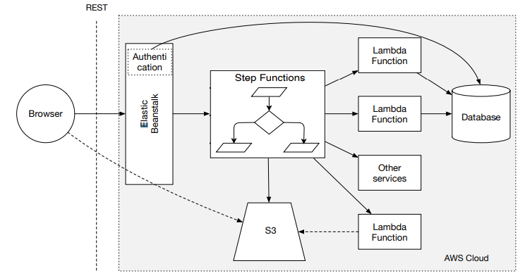

# services_engineering_assignment
<p align='center'>
    
    
    
    
</p>

# Repository Structure

```
.
├── ARCH
├── DEV
│   └── clinic
│   └── clinic_frontend
└── PM
```


# Requirements

## Backend
```sh
python -m pip install clinic/requirements.txt
```

## Frontend
```sh
cd DEV/clinic_frontend
npm install
```

# Running
## Backend
```sh
cd DEV/clinic
python manage.py runserver
```

## Frontend
```sh
cd DEV/clinic_frontend
npm start
```

# Testing
## Backend
```sh
cd DEV/clinic
python manage.py test
```

## Frontend
```sh
¯\_(ツ)_/¯
```

# Description of the service

## Website
- Login
- Schedule Appointments

## Scheduling Appointments
1. Login
2. Select type of specialty
3. Specify doctor's name (optional)
4. Payment

### Specialties:
- Massage
- Evaluation appointment
- Musculoskeletal physiotherapy
- Therapeutic massage
- Shock waves

## Payment
1. Receive SMS with payment link
2. Select payment method
3. Provide invoice details
4. Pay
5. Receive invoice in email

### Payment Methods
#### Multibanco
- Generates reference numbers
#### MB Way
- Requires valid phone number

## Appointment Day (on the clinic)
1. User arrives
2. Facial recognition to identify user
3. User's name is displayed on the waiting room screen as well as estimated waiting time and room number

## Login & Authentication
### Login

1. User inserts username & password
2. Server verifies user's credentials
3. Server generates JWT
4. Server sends JWT with cookies of the login response

### Authentication
The requests to the API must include a JWT in the cookies


# Architecture
The backend architecture in the cloud is as follows:



## Elastic Beanstalk
This service runs the Django Rest Framework API

## S3
This service stores static files like images from the database used for the Rekognition service and the react application itself.


# Running a containerized version (Docker)
## Install Docker
```sh
# Add Docker's official GPG key:
sudo apt-get update
sudo apt-get install ca-certificates curl
sudo install -m 0755 -d /etc/apt/keyrings
sudo curl -fsSL https://download.docker.com/linux/ubuntu/gpg -o /etc/apt/keyrings/docker.asc
sudo chmod a+r /etc/apt/keyrings/docker.asc

# Add the repository to Apt sources:
echo \
  "deb [arch=$(dpkg --print-architecture) signed-by=/etc/apt/keyrings/docker.asc] https://download.docker.com/linux/ubuntu \
  $(. /etc/os-release && echo "$VERSION_CODENAME") stable" | \
  sudo tee /etc/apt/sources.list.d/docker.list > /dev/null
sudo apt-get update
sudo apt-get install docker-ce docker-ce-cli containerd.io docker-buildx-plugin docker-compose-plugin
```

## Building the system
```sh
docker compose up --build -d
```

This command should be used to refresh changes made in the source code files.

# Deploying frontend app to S3
```sh
cd clinic_frontend
npm run build
cd ..
python deploy_frontend.py [-e s3_endpoint_url]
```

`-e` flag should be used for the docker container (`http://localhost:9090`).

If the target S3 bucket lives on the AWS cloud then not providing the `-e` should suffice.
