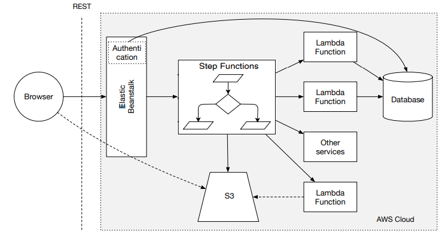

# services_engineering_assignment
Services engineering project

# Installing requirements

```sh
python -m pip install DEV/.devcontainer/requirements.txt
```

# ARCH



## Elastic Beanstalk

Runs django and the authentication system.

## Workflow

When a button is clicked, django lauches a workflow that runs a lambda function.

## Database

Cannot be sqlite3 (default to django). Instead SimpleDB or DynamoDB should be used. More that one should be used to separate the storage of user data and other things.
